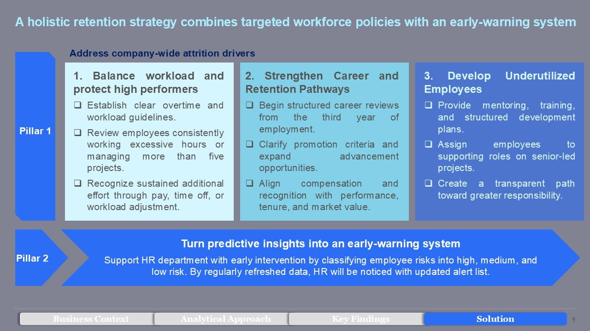
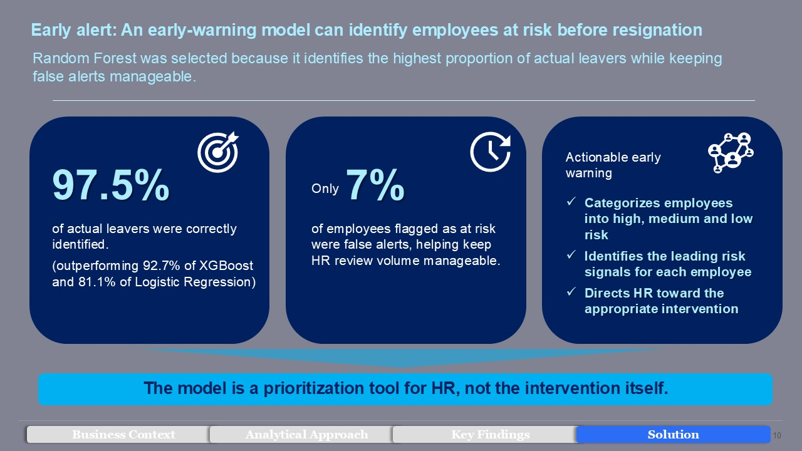

# HR analytics project: Employee Attrition Analytics & Early-Warning System
> A people analytics project that explores employee attrition patterns, identifies vulnerable workforce segments, and proposes a data-informed retention framework for proactive HR intervention.

---
## Project Overview

Employee turnover is rarely driven by a single factor. Excessive workload may lead to burnout, but lower workload does not automatically guarantee retention. High performers may still leave despite relatively high job satisfaction, especially when compensation or career progression does not keep pace with contribution.

This project combines exploratory analysis and predictive modeling to help HR move from **reactive turnover management** to **proactive retention**.

The analysis answers three leadership questions:

1. **Why are employees leaving?**
2. **Who is most likely to leave next?**
3. **How should HR respond to different attrition-risk patterns?**

---
## Technologies & Techniques
* **Python:** Pandas, NumPy, Matplotlib, Seaborn, Scikit-learn, Statsmodels, and XGBoost.
* **Analytics:** Data cleaning, EDA, cohort analysis, correlation analysis, and business-focused visualization.
* **Modeling:** Logistic Regression, Random Forest, XGBoost, threshold tuning, GridSearchCV, and feature importance.
* **Evaluation:** Precision, Recall, F1-score, Accuracy, ROC-AUC, and Precision-Recall Curve.

---
## Analytical Approach
The project follows a three-stage approach:

### 1. Understand why employees leave

Employee patterns were explored across eight workforce attributes, including:

- Satisfaction
- Number of projects
- Average monthly working hours
- Performance
- Tenure
- Salary
- Promotion history
- Department

### 2. Predict who may leave

Multiple predictive approaches were evaluated:

- Logistic Regression
- Random Forest
- XGBoost

Random Forest was selected as the champion model because the business priority is to identify as many actual leavers as possible while keeping false alerts manageable.

### 3. Enable early intervention

The proposed operating model converts employee risk signals into:

- High-, medium-, and low-risk employee segments
- An HR review and prioritization list
- Targeted intervention playbooks
- Periodically refreshed risk monitoring


---
## Executive Summary


---
### Recommendations





---
## 📁 Repository structure

```text
├── data/
│   └── HR_capstone_project.csv                                   # Raw dataset includes 14,999 entries
├── analysis/
│   └── Salifort_Motors_HR_analytics_project.ipynb                # Exploratory analysis and model development
│   └── RF_cv.pickle                                              # Random Forest model saved to pickle
│   └── XGB_cv.pickle                                             # XGBoost model saved to pickle
├── images/
│   └── Executive Summary.jpg                                     # Exploratory analysis and model development
│   └── Holistic-strategy-with-an-early-warning-system.jpg        # Random Forest model saved to pickle
│   └── Random-Forest-results.jpg                                 # XGBoost model saved to pickle
├── Reducing employee turnover through data-driven actions.ppt    # Executive presentation with 4 key findings & solutions for HR stakeholders
└── README.md                                                       
```

---

## Disclaimer

This project is intended as a people analytics and decision-support case study. Predictive outputs should not be used as the sole basis for employment decisions. All interventions should involve qualified human review and comply with applicable privacy, employment, and data-governance requirements.
